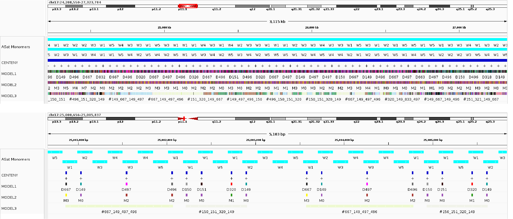

# GCP - Genomic Centromere Profiling
A repository of the Genomic Centromere Profiling (GCP) codes and associated files as in Corda & Giunta 2025, Science. Briefly, in this work we report our discovery of the conserved position of a specific centromeric DNA motif across human and primates genomes. We leveraged the exact conservation to extract a numerical rendering of human DNA based on distances from one motif to the next, enabling us to study centromere organization and architecture at scale.

https://www.science.org/doi/10.1126/science.ads3484

Free copy available here: https://sites.google.com/uniroma1.it/giuntalab/research

[](https://doi.org/10.5281/zenodo.14914139)

---
Utilities to analyze and annotate the human centromere based on the pattern of numerical values derived from the nucleotide distance between consecutive DNA motifs - in this case, using the designated functional centromeric string as query (**CENP-B box**).


[Full description here](/description/README.md)


## Install
To install and run **GCP_Centeny**, please clone the repository and then create and activate the **GCP** conda environment as follows:

```
git clone https://github.com/GiuntaLab/GCP-Centeny.git
cd GCP-Centeny/

#Creates GCP environment
conda env create -f environment.yml
conda activate GCP

#Shows GCP available commands
cd R/
Rscript GCP.R --help
```

## Tutorial
[Full description here](/description/README.md)

Running fuzznuc to search for the CENP-B box within the FASTA file. 
```
Rscript GCP.R fuzznuc -fa ../test/chr17.t2t-chm13-v2.0.fa -seq NTTCGNNNNANNCGGGN -o ../output
```
Running CENTENY (visualize query orientation as marker on chromosome):
```
Rscript GCP.R centeny --input ../output/chr17.t2t-chm13-v2.0.fa_NTTCGNNNNANNCGGGN.bed --length ../output/chr17.t2t-chm13-v2.0.fa_NTTCGNNNNANNCGGGN_length.tsv --n_box 50 --output_file ../output/centeny.bed
```
Running MODEL1 (CHM13-derived distance values):
```
Rscript GCP.R model1 -i ../output/chr17.t2t-chm13-v2.0.fa_NTTCGNNNNANNCGGGN.bed -d ../file/chm13_model1.txt -o ../output/model1.bed
```
Running MODEL2 (monomer-based annotation):
```
Rscript GCP.R model2 -i ../output/chr17.t2t-chm13-v2.0.fa_NTTCGNNNNANNCGGGN.bed -d ../file/model2.txt -o ../output/model2.bed
```
Running MODEL3 (k-pattern annotation):
```
Rscript GCP.R model3 -i ../output/chr17.t2t-chm13-v2.0.fa_NTTCGNNNNANNCGGGN.bed -k 4 -fq 5 -o ../output/model3.bed
```
Running reads retrieval (uses input from model3):
```
Rscript GCP.R reads_retrieval -i ../test/ONT_100kb_2023_07_28_all_fasta_NTTCGNNNNANNCGGGN.bed -p ../output/pattern_counts_sliding1_k4.txt --chr chr17 --n_box 4 --n_pattern 10 --n_matches 1 --n_cores 5 -o ../output/chr17_specific_reads.txt
```

## Results
Generates CENP-B box annotation in chromosome 17 (CHM13) by using **CENTENY**, **MODEL1**, **MODEL2**, and **MODEL3**.



### References:
Corda, L. & Giunta, S. **Chromosome-specific centromeric patterns define the centeny map of the human genome.** Science 389, eads3484 (2025).
